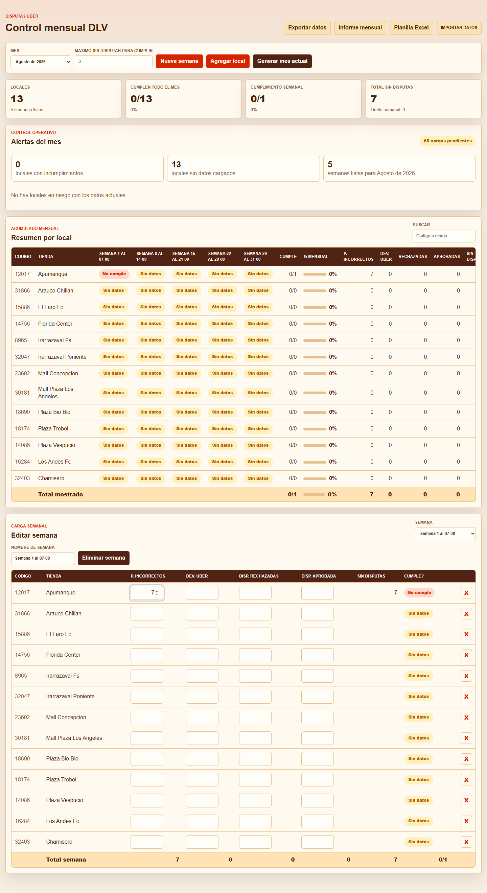
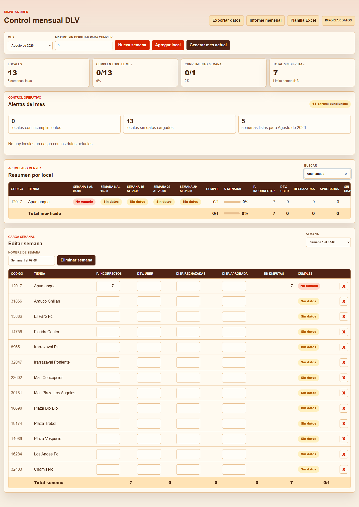

# Control mensual DLV

App local para controlar disputas Uber por local, semana y mes.

## Como abrir la app

1. Descarga o clona este repositorio.
2. Abre el archivo `index.html` con Google Chrome, Microsoft Edge o Firefox.
3. Usa la app directamente desde el navegador.

No necesita instalar Node, Python, base de datos ni servidor.

Tambien puedes abrir `Control mensual DLV.html`; se deja como copia con nombre amigable para usuarios finales.

## Acceso directo automatico

Para crear un acceso directo en el escritorio:

1. Ejecuta `Crear acceso directo.bat`.
2. Se creara `Control mensual DLV.lnk` en el escritorio.
3. El acceso directo usa el icono de la app.

Si Windows bloquea scripts, abre PowerShell en la carpeta del proyecto y ejecuta:

```powershell
powershell -ExecutionPolicy Bypass -File .\tools\crear-acceso-directo.ps1
```

## Modo app instalable

La app incluye `manifest.webmanifest` y `service-worker.js`, por lo que puede comportarse como PWA cuando se abre desde un servidor local o desde una URL web.

Para iniciar en servidor local:

```powershell
.\Iniciar app local.bat
```

Luego, en Edge o Chrome, puedes usar la opcion del navegador para instalar la app si aparece disponible.

El archivo `index.html` sigue funcionando directo, asi que la app no depende del instalador ni del modo PWA.

## Capturas





## Uso diario

1. Selecciona el mes en el desplegable `Mes`.
2. Revisa que las semanas generadas sean correctas.
3. En `Carga semanal`, selecciona la semana que quieres completar.
4. Ingresa por local:
   - `P. incorrectos`
   - `Dev. Uber`
   - `Disp. rechazadas`
   - `Disp. aprobada`
5. La app calcula automaticamente:
   - `Sin disputas`
   - `Cumple?`
   - resumen mensual
   - porcentaje mensual
   - alertas del mes

## Regla de cumplimiento

Un local cumple una semana cuando:

```text
Sin disputas <= Maximo sin disputar para cumplir
```

Por defecto, el maximo es `3`.

La formula usada es:

```text
Sin disputas = P. incorrectos - Dev. Uber - Disp. rechazadas - Disp. aprobada
```

## Datos y respaldos

Los datos se guardan localmente en el navegador de cada computador. Si otra persona abre la app en otro PC, tendra una base vacia hasta importar un respaldo.

Para mover datos entre computadores:

1. En el PC origen, pulsa `Exportar datos`.
2. Guarda el archivo `.json`.
3. En el PC destino, abre la app y pulsa `Importar datos`.
4. Selecciona el archivo `.json`.

## Exportaciones

- `Informe mensual`: descarga un HTML bonito e imprimible.
- `Planilla Excel`: descarga una planilla `.xls` generada desde la app.
- `Exportar datos`: descarga respaldo JSON con todos los meses guardados.

## Planilla complementaria

El archivo `docs/planilla-control-dlv.xlsx` incluye una version Excel editable con hojas:

- `Resumen Mensual`
- `Carga Semanal`
- `Locales`
- `Parametros`

Sirve como respaldo formal o como alternativa para usuarios que prefieren Excel.

## Estructura del proyecto

```text
.
├── index.html
├── Control mensual DLV.html
├── manifest.webmanifest
├── service-worker.js
├── Crear acceso directo.bat
├── Iniciar app local.bat
├── assets/
│   ├── icons/
│   └── screenshots/
├── docs/
│   └── planilla-control-dlv.xlsx
├── src/
│   ├── app.js
│   └── styles.css
└── tools/
    ├── crear-acceso-directo.ps1
    └── iniciar-app-local.ps1
```

## Recomendaciones

- Exporta respaldo JSON al terminar cada mes.
- No borres datos del navegador sin antes exportar respaldo.
- Usa `Informe mensual` para enviar o imprimir resultados.
- Usa `Planilla Excel` cuando necesites trabajar fuera de la app.
